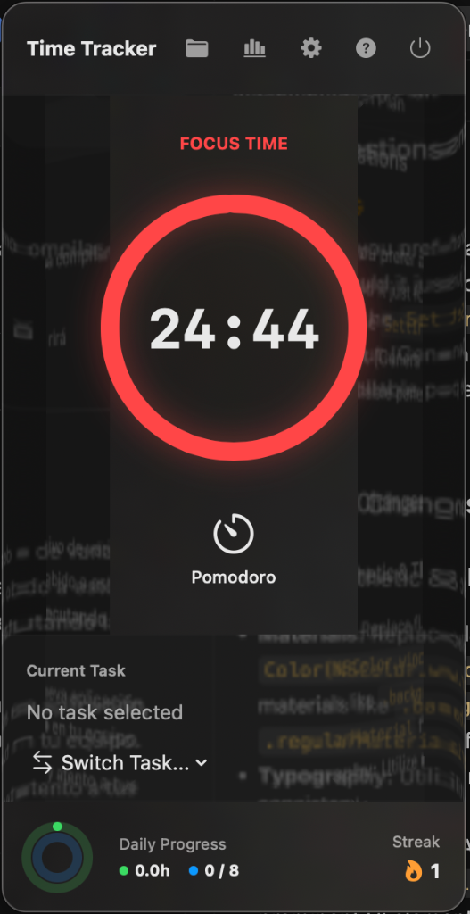
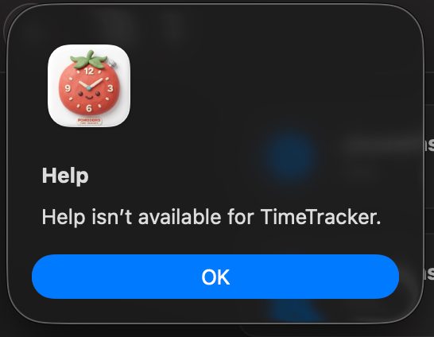
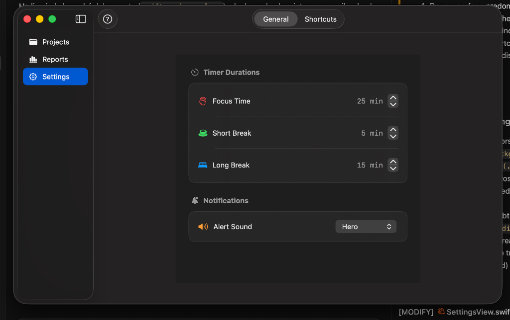

<div align="center">
  
  
  # PomoFlow for macOS
  
  **An advanced, privacy-first, hybrid time tracking and Pomodoro application for macOS.**
  
  
  
  
  
</div>

---

PomoFlow is built entirely with SwiftUI and SwiftPM (no Xcode project files required!). It offers a premium glassmorphic interface alongside enterprise-level focus and security features. It's designed for freelancers, developers, and anyone who needs to combine billing and productivity seamlessly.

## ✨ Key Features

### 🍅 Hybrid Tracking
Combine traditional task-based time tracking (to calculate hourly rates and billable hours) with the proven Pomodoro Technique for maximum focus.

<div align="center">
  
</div>

### 🎨 Premium macOS Interface
A sleek, native SwiftUI interface leveraging `.ultraThinMaterial` for beautiful glassmorphism, responsive hover states, and smooth animations.

### ⚡ Menu Bar "Live Timer"
Keep an eye on your remaining focus time right from your system status bar without opening the main app. Click the icon to instantly pause or start your Pomodoros.

<div align="center">
  
</div>

### 🛡 Strict Focus Mode
When a Pomodoro session starts, the app can automatically hide all other applications, leaving you in a distraction-free environment. Built securely using native Cocoa APIs.

### ⌨️ Global Keyboard Shortcuts
Start, pause, or check your Pomodoro status from anywhere in macOS using customizable global hotkeys (`Cmd + Option + P`, `Cmd + Option + O`, etc.).

### 📊 Advanced Reports & CSV Export
View beautiful dashboard metrics of your daily progress, streaks, and earnings, and export detailed CSV reports with a single click.

<div align="center">
  
</div>

### 🔒 Secure by Design
Data is saved locally using macOS File Protection (`.completeFileProtectionUnlessOpen`). The app architecture is entirely offline, meaning your productivity data never leaves your machine.

---

## 🚀 Getting Started

PomoFlow is built using the Swift Package Manager. You don't need to open Xcode to compile it; standard terminal commands are enough.

### Prerequisites
- macOS 14.0 (Sonoma) or newer.
- Swift 5.9+ (included with Xcode 15+ or Command Line Tools).

### Building and Running
We provide a convenient bash script to compile and run the application.

```bash
# 1. Clone the repository
git clone https://github.com/chamakov/PomoFlow.git
cd PomoFlow

# 2. Compile and run
./Scripts/compile_and_run.sh
```

### Packaging for Release
To create a release version (`PomoFlow.app`) that you can move to your `/Applications` folder:

```bash
./Scripts/package_app.sh release
```
The script will generate a fully bundled `PomoFlow.app` in the root directory.

---

## 🛠 Architecture
* **SwiftUI:** The entire UI is built declaratively using modern SwiftUI (WindowGroups, MenuBarExtra, NavigationSplitView).
* **Observation Framework:** State management is handled through the new `@Observable` macro via a central `PomoFlowStore`.
* **SwiftPM:** The project uses `Package.swift` instead of `.xcodeproj`. This keeps the repository clean, prevents merge conflicts on project files, and makes CI/CD a breeze.

## 🔒 Mac App Store & Sandboxing
If you intend to fork this project and submit it to the Mac App Store, please note:
1. You must enable the App Sandbox.
2. Edit `Scripts/package_app.sh` and uncomment the entitlements for `com.apple.security.app-sandbox` and `com.apple.security.automation.apple-events`.

## 🤝 Contributing
Contributions, issues, and feature requests are welcome! Feel free to check the [issues page](https://github.com/chamakov/PomoFlow/issues).

## 📝 License
This project is licensed under the MIT License - see the [LICENSE](LICENSE) file for details.
